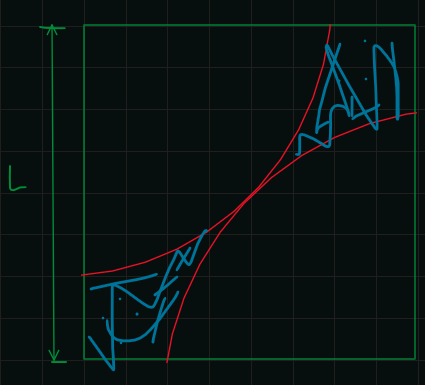

# Algoritmos

Def. Secuencia de pasos no ambiguos que se deben seguir a partir de unos datos para llegar a la solución de un problema en un tiempo finito.

## Tipos de problemas

* Problemas númericos.
* problemas no númericos.

## Formas de reprecentar algoritmos

(a) Forma narrada en textual: se redactan los pasos.  
(b) forma gráfica:

* Diagramas de flujo.
* Diagramas NS.

(c) En seudo códio: Emplea un lenguage algoritmico.

## Elementos del seudo código

### Tipos de datos

1. ```Númericos``` Para datos de tipos númericos.
2. ```No númericos``` Para datos que no sean númericos.
3. ```Lógicos``` Solo acepta uno de dos valores.

### Operadores

### Funciones internas

1. ```ENTERO(x)```: Devuelve la parte entera de x.
2. ```MODULO(A, B)```: Devuelve $A|B$.
3. ```RAIZ(x)```: Devuelve $\sqrt{x}$.
4. ```LOG(x)```: Devuelve $\log(x)$.
5. ```LN(x)```: Devuelve $\ln(x)$.
6. ```SIN(x)```: devuelve $\sin(x)$.
7. ```COS(x)```: Devuelve $\cos(x)$.

## Costruyendo un algoritmo

### 1. Declaración de variables

Se utiliza para indicar el nombre de las variables y su tipo, las
mismas que se utilizan en el algoritmo y sigue la siguiente
sintaxis:

```python
    variables TIPO: [lista de variables]
```

donde ```TIPO``` pueden ser: ```ENTERAS```, ```REALES```, ```DE TEXTO```,
```LOGICAS```.

Y las ```listas de variables``` pueden ser una o mas separadas por comas
```,```.

### 2. Asignando valores a las variables

#### Operador de asignación ($\leftarrow$)

Se utiliza para dar valores a las variables. y se utiliza como muestra
la siguiente instrucción

```python
variable1 <- [varaible2, constante, expresion aritmetica]
```

NOTA: cualquier valor que tenga una variable al usar el operador
$\leftarrow$ sobrescribe el valor de dicha variable con el nuevo
valor.

### 3. Instrucción de entrada ```LEER```

Se utiliza para ingresar o pedir valores para las variables en el
momento que se ejectua el algoritmo y sigue la siguiente sintaxis:

```python
LEER: [lista de variables]
```

donde ```[lista de variables]``` es una o mas variables separadas
por comas, ejem:

```python
LEER: var1, var2, ...
```

### 5. Instrucción ```ESCRIBIR```

Se tuliza para mostrar, escribir e imprimir los resultados, que son la solución del problema formulado, y sigue la siguiente sintaxis:

```python
ESCRIBIR [lista de variables, constantes, expresiones aritméticas o lógicas]
```

donde ```[lista de variables,  constantes, expresiones ariméticas o lógicas]``` es una o mas
variables, constantes, expresiones separadas con comas ```,```.

```python
ESCRIBIR: var1, var2, ...
```

O escribir texto

```python
ESCRIBIR: "Hola mundo"
```

O convinado

```python
ESCRIBIR: "Hola ", nombre, ", yo tengo ", edad, " años."
```

## Resolución de problemas

Se tiene las siguientes faces

### 1. Análisis del problema

1. Salida o resultado.
2.  Entrada o datos.
3. Proceso.

### 2. Diseño del algoritmo

4. Codificación y depuración
5. Compliación y ejecución.
6. Documentación y mantenimiento.

## Problemas

### Ejercicio 1

Escribir un algoritmo en seudo codigo para hallar el volumen de un cono.

SOLUCIÓN

SALIDA: Volumen de un cono.  
ENTRADA: ```radio``` del cono y la ```altura``` del cono.  
PROCESO: $\pi r^2 h/3$

Algoritmo: se utilizará ```^``` en ves de $\uparrow$

```python
variables REALES: radio, altura, volumen
LEER: radio, altura

volumen <- 3.14159 * r^2 * h / 3

ESCRIBIR: "El volumen del cono es: ", volumen
```

### Ejercicio 2

Escribir un algorimo en seudocodigo para convertir soles a
doleres

SALIDA: valor de la moneda en dolares  
ENTRADA: soles  
PROCESO: Dividirlo entre el precio del dolar

```python
variables REALES: soles, tipo_de_cambio, dolares
LEER: soles

dolares <- soles/tipo_de_cambio

ESCRIBIR: "En S/.", soles, " hay $", dolares
```

Salida: para ```soles = 1000```, ```tipo_de_cambio = 2```

```python
En S/.1000 hay $5000
```

### Ejercicio 3

Se quiere depositar una canditad de soles ```capital```
a unos determinas periodos de tiempo ```interes```
con una tasa de interes ```tasa```, para obtener un determinado
monnto en soles ```monto```. Escribir un algoritmo para determinar:
Cuántos periosdos son necesarios para obtener al monto deseado?
sabiendo que
$$monto = capital(1 + tasa)^{periodo}$$

__SOLUCION__  
SALIDA: periodos de tiempo  
ENTRADA: capital, tasa, monto  
SALIDA:
$$periodo = \frac{\ln(\frac{monto}{capital})}{\ln(periodo + 1)}$$

Algoritmo

```python
variables REALES: capital, monto, tasa, periodo
LEER: monto, tasa, capital

periodo <- LN(monto/capital)/ln(periodo + 1)

SALIDA: "Los periodos necesarios son: ", periodo
```

### Ejercicio 4

Escribir un algorimo para intercambiar el valor de dos variables

SALIDA: Valor intercambiado de las variables  
ENTRADA: Valor de cada variable  
PROCESO: Tomar el valor de la segunda variable guardarlo...

Algoritmo

```python
variables REALES: var1, var2, auxillar
LEER: var1, var2

auxillar <- var1
var1 <- var2
var2 <- axillar

ESCRIBIR: "Los valores intercambiados son: ", var1, var2
```

### Ejercicio 5

Escribir un algoritmo para intercabiar el valor de las variables
```a```, ```b``` y ```c``` de tal manera que al final la variable ```a``` contenga el valor ```c```, ```b``` el de ```a``` y ```c``` el de ```b```.

__SOLUCIÓN__. Algoritmo

```python
variables REALES: a, b, c, aux

aux <- a
a <- c
c <- b
b <- aux

ESCRIBIR: "El valor de a, b, c ",
        "intercambiado respectivamente es: ", a, b, c
```

### Ejercicio 6

Escribir un algoritmo para hallar el área sombreada de la figura siguiente:


SOLUCION

Salida: Area sombreada  
ENTRADA:longitud Lado del cuadrado  
PROCEDIMIENTO: Con la formula del area sombreada

Algoritmo

```python
variables REALES: lado, area_sombreada
LEER: lado

area_sombreada <- L^2 - 3.14159 * (2^(1/2) * l/2)^2/2

ESCRIBIR: "El area sombreada es: ", area_sombreada
```

## MatLab y seudo-código

(Laboratorio matricial)

### 1. Seudo códio a matlab

Conversion
|instrucción|seudo código| matlab |  
|---|---|--|
|Declaraación de variables | ```variables TIPO: [lista de variables]```| declaración automática de variables|
|asignación de variables | ```var <- [valor]```| ```var = [valor];```|
|instrucción de entrada |```LEER: var```| ```var = input('[mensaje]');```|
|instrucción de salida | ```ESCRIBIR: [lista de salida]```| ```disp([variables, '[texto]', expreción aritmetica]);```|
|operadores aritmeticos| $\uparrow$, ```*```, ```/```, ```+```, ```-```|```^```, ```*```, ```/```, ```+```,```-```|
|operadores de comparación| >, $\geq$, <, $\leq$, =, $\neq$ | >, >=, <=, ==, ~=|
|Operadores lógicos| $\sim$, $\wedge$, $\vee$ | ~, &&, \|\| |
|Función parte entera|ENTERO(x/y)| fix(x/y) |
|función módulo|MODULO(x, y)|rem(x, y)|

### Ejemplo

Escribir un algorimo para obtener el número de saludos de $n$ personas
que asisten a una reunión considerando que se saludan todos y solo una
vez.

Algoritmo

```python
varaibles ENTERAS: n, num_saludos 
LEER: n

num_saludos <- n * (n - 1)/2

ESCRIBIR: "El número de saludos es: ", num_saludos
```

En MatLab

```MatLab
n = input('Ingrese el número de personas')
num_saludos = n * (n - 1)/2

disp("El número de saludos es: ")

disp(num_saludos)
```
